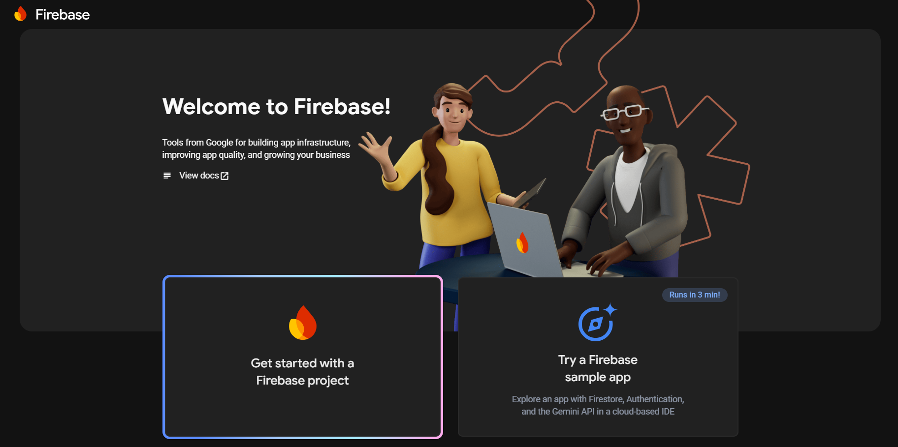
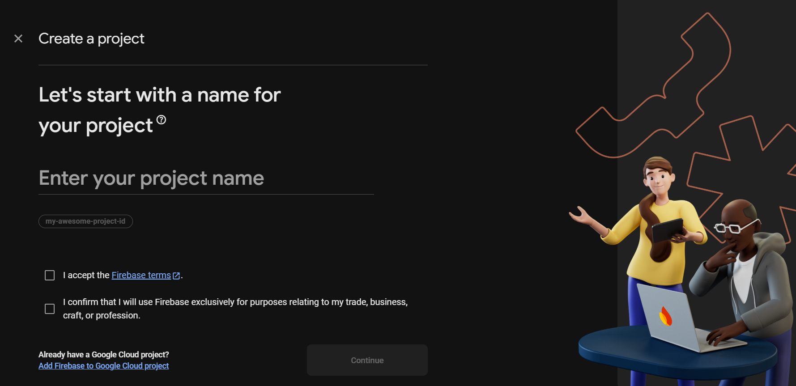
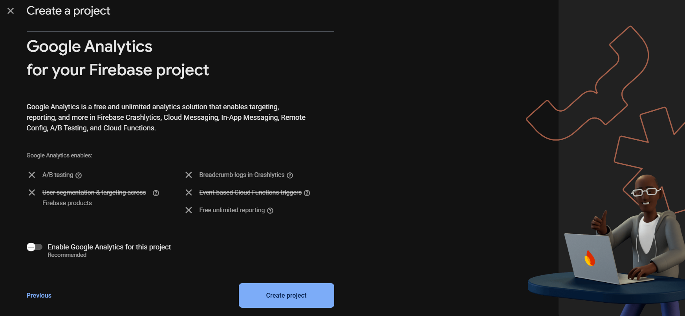
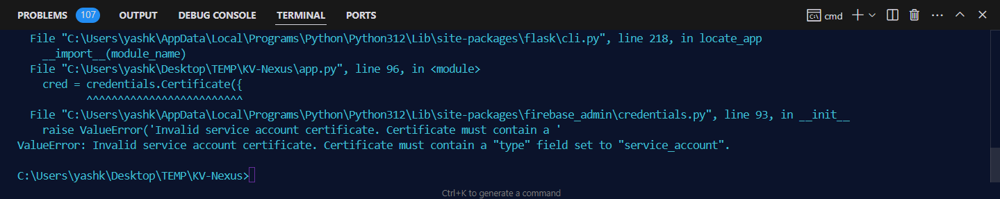
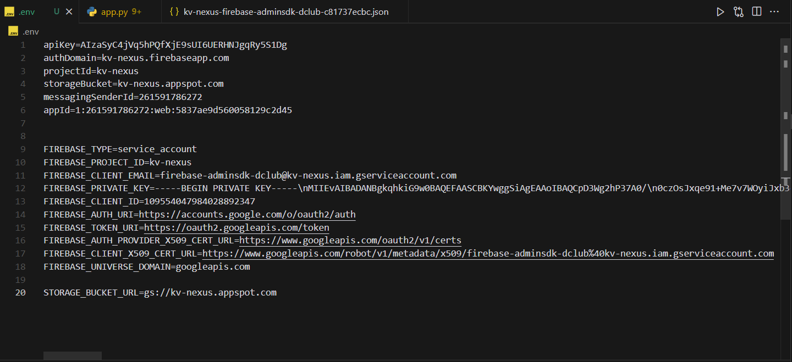

# Project Setup Guide

## Prerequisites

- **Python 3.10+**: [Download Python](https://www.python.org/downloads/)
- **Git**: [Install Git](https://git-scm.com/downloads)
- **Firebase Console**: [Firebase Console](https://console.firebase.google.com/)

## Clone the Repository

```bash
git clone https://github.com/kvcops/KV-Nexus.git
cd KV-Nexus
```

## Create a Virtual Environment

It's recommended to use a virtual environment to manage dependencies.

```bash
python -m venv venv
```

Activate the virtual environment:

- **On Windows:**
  ```bash
  venv\Scripts\activate
  ```
- **On macOS/Linux:**
  ```bash
  source venv/bin/activate
  ```

## Setup Firebase

<div style="display: flex; justify-content: center;">   
    
</div>


### 1. Create a Firebase Project

You will need to create a Firebase project to host your database. This project will be used to store your database and other resources. Make sure to select the region closest to you.

If you don't have a Firebase project:

1. Go to the [Firebase Console](https://console.firebase.google.com/).

2. Click on "Add project" and follow the prompts to create a new project.

<div style="display: flex; justify-content: center;">       
    
</div>

3. Choosing the Google Analytics for this project is optional, but it is recommended.

<div style="display: flex; justify-content: center;">   
    
</div>

4. Click on "Continue" to create your project. Wait for Firebase to finish creating your project.

<div style="display: flex; justify-content: center;">
    <video src="./static/assets/project.webm" alt="Create Firebase Project 2" title="Create Firebase Project 2" width="500" height="auto" controls autoplay loop muted></video>
</div>

### 2. Generate a Service Account Key

1. In the Firebase Console, select your project.
2. Click the gear icon (⚙️) next to "Project Overview" and select **Project settings**.
3. Navigate to the **Service accounts** tab.
4. Click on **Generate new private key**.
5. A JSON file will be downloaded. **Keep this file secure** and do not commit it to version control.

<div style="display: flex; justify-content: center;">
    <video src="./static/assets/service-account.webm" alt="Service Account" title="Service Account" width="500" height="auto" controls autoplay loop muted></video>
</div>

### 3. Configure Environment Variables

Extract the necessary values from the downloaded JSON file and set them as environment variables.

Create a `.env` file in the root directory of your project:

```env
FIREBASE_PROJECT_ID=your_project_id
FIREBASE_CLIENT_EMAIL=your_client_email
FIREBASE_PRIVATE_KEY=your_private_key
FIREBASE_CLIENT_ID=client_id
FIREBASE_AUTH_URI=auth_uri
FIREBASE_TOKEN_URI=token_uri
FIREBASE_AUTH_PROVIDER_X509_CERT_URL=auth_provider_x509_cert_url
FIREBASE_CLIENT_X509_CERT_URL=client_x509_cert_url
FIREBASE_UNIVERSE_DOMAIN=universe_domain
```

*Replace `your_project_id`, `your_client_email`, and `your_private_key` with the corresponding values from the JSON file.*

<div style="display: flex; justify-content: center;">
    <video src="./static/assets/env-setup.webm" alt="Environment Variables" title="Environment Variables" width="500" height="auto" controls autoplay loop muted></video>
</div>

> **Note:** Ensure that the `serviceAccountKey.json` file and `.env` file are added to your `.gitignore` to prevent them from being pushed to version control.

### 4. Storage Bucket

1. In the Firebase Console, select your project.
2. Click on **Storage** in the left sidebar.
3. Scroll down and click on **Firebase Storage** in the center of the page.
4. Choose the region closest to you. In my case, I chose **Asia-east2 (hong kong)**.
5. Always select the **Start in production mode**.
6. Click on **Next**.

<div style="display: flex; justify-content: center;">
    <video src="./static/assets/storage-bucket.mp4" alt="Storage Bucket" title="Storage Bucket" width="500" height="auto" controls autoplay loop muted></video>
</div>

7. **STORAGE_BUCKET_URL**: This is found in the Firebase console under Storage.Also make sure that the **STORAGE_BUCKET_URL** is correctly set like this.

```env
STORAGE_BUCKET_URL=gs://<your-project-id>.appspot.com
```

#### 5. Miscellaneous variables
    
```env
authDomain=
projectId=
storageBucket=
messagingSenderId=
appId=
```

<div style="display: flex; justify-content: center;">
    <video src="./static/assets/misc-env.webm" alt="Miscellaneous Variables" title="Miscellaneous Variables" width="500" height="auto" controls autoplay loop muted></video>
</div>

## Install Dependencies

Ensure you have pip installed, then install the required packages:

```bash
pip install -r requirements.txt
```
## Run the Application

With everything set up, you can now run the application:

```bash
flask run
```
NOTE: If you encounter an issue related to type "field" like one shown below:-

<div style="display: flex; justify-content: center;">
    
</div>

Simply add a env var to specify the type of the firebase account.

```env
FIREBASE_TYPE=service_account
```

<div style="display: flex; justify-content: center;">
    <video src="./static/assets/final.webm" alt="Final Setup" title="Final Setup" width="500" height="auto" controls autoplay loop muted></video>
</div>

Once all the above steps are done, you should be able to run the application without any issues.
your .env file should look like this.

<div style="display: flex; justify-content: center;">
    
</div>

## Additional Notes

- **Database Setup:** If your application uses a database, ensure it's properly configured and migrated.
- **Environment Variables:** Consider using tools like `python-dotenv` to manage environment variables seamlessly.
- **Security:** Always keep your service account keys and other sensitive information secure. Avoid hardcoding them in your codebase.

Also make sure to obtain these API keys from the respective websites. As they are also used in the application.

```bash
mailjet_api_key = os.environ.get("mail_API_KEY")  # Replace with your Mailjet API key
mailjet_api_secret = os.environ.get("mail_API_SECRET")  # Replace with your Mailjet API secret
mailjet = Client(auth=(mailjet_api_key, mailjet_api_secret), version='v3.1')
google_api_key = os.environ.get("API_KEY")
unsplash_api_key = os.getenv('UNSPLASH_API_KEY')
openweathermap_api_key = os.getenv('OPENWEATHERMAP_API_KEY')
```

### Thank you for following this guide. I hope you found it helpful.

